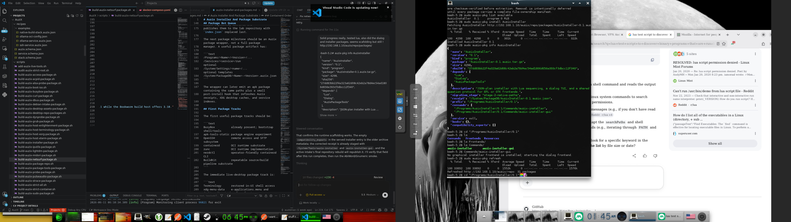

# Auzix Installer And Package Substrate

## Immediate Goal

The strict-root ISO now provides live desktop access and standalone
persistence:

1. boot from the ISO
2. transpose the live Auzix root to local storage
3. install GRUB and the Auzix kernel/initramfs
4. boot the installed root without the ISO
5. refresh the repository and add packages persistently

## Current Installer Shape

The live ISO includes:

```text
/System/Tools/auzix-install-disk
```

Usage from the booted ISO:

```sh
/System/Tools/auzix-install-disk --force /dev/vda
```

That command:

- wipes the target disk partition table
- creates one Linux partition
- formats it as ext4 with label `AUZIXROOT` when e2fsprogs is available
- emits an explicit warning before falling back to ext2
- copies the live Auzix root onto it
- installs GRUB for BIOS boot
- writes the kernel command line using `root=LABEL=AUZIXROOT`
- writes an install note under `/System/Settings/install`

The normal result boots directly from the target disk. The ISO remains a
recovery fallback and can still hand off to an installed root with:

```text
auzix.root=LABEL=AUZIXROOT
```

The ISO init then mounts that root and `switch_root`s into it.

The current GRUB package is BIOS-first. UEFI installation remains follow-up
work.

## Package Manager Choice

Recommendation: adopt `apk-tools` as the first low-level package engine
candidate, but keep Auzix receipts as the distribution contract.

That means:

- `.apk` or apk-style packages can move files and solve dependencies.
- `/System/PackageDB/*.auzix.json` remains the higher-level receipt.
- `/Programs`, `/Services`, `/Stacks`, and `/Work` remain Auzix concepts.
- BKC pipelines should reason about Auzix receipts, not raw package-manager
  implementation details.

Why `apk-tools` is the best first candidate:

- it is small and already proven in BusyBox/musl-style systems
- it has a static tool package path, which matters during bootstrap
- it supports repository indexes and dependency solving without adopting a
  heavyweight distro base
- it is simpler to carry in a tiny live image than dpkg/rpm stacks

Why not invent a package manager first:

- package solving, repository indexes, signatures, upgrades, and file ownership
  are real projects
- Auzix needs path policy, service receipts, and stack relationships more than
  it needs a brand-new solver
- custom package metadata can wrap apk rather than replace it

Why not adopt apk as the whole identity:

- apk knows packages, not Auzix service/stack intent
- apk does not define `/Programs` ownership semantics by itself
- apk does not express BKC pipeline relationships

So the split should be:

```text
apk-tools       low-level package install/upgrade/remove engine
Auzix receipts  path, service, stack, validation, and pipeline contract
BKC             orchestration and remote execution
```

Current working decision:

- keep `/System/PackageDB/*.auzix.json` as the immediate package database
- keep repository and local transaction caches as JSON while the schema is
  still changing; move to SQLite only when package volume or query load makes
  indexed access worthwhile
- use `/System/Tools/auzix-pkg` for repository refresh, inspection, dependency
  installation, checksum verification, and installed-state updates
- treat `.apk` as the first repository/index/install transport to prototype
- do not adopt Anaconda as the installer base; it is valuable as a reference for
  partitioning and guided install flow, but too large and distro-policy-heavy for
  the live image
- keep the live ISO installer shell/Lua path small until package install,
  desktop launch, and persistence are stable
- keep one JSON install-plan contract behind every front end: shell remains the
  execution layer, Lua validates and sequences the plan, and `dialog` or
  `zenity` can collect answers without duplicating partition/install logic
- start with a terminal question flow as the fallback and a GTK question flow
  when the graphical session is available; an EFL-native installer can replace
  the GTK presentation later while consuming the same plan
- BKC follow-up: run the same install-plan validation and image contract checks
  as pipeline steps, then evaluate a bounded build/test/commit loop. Keep commit
  creation gated on a clean diff and successful checks; pushing should remain an
  explicit policy decision rather than an unconditional hook.

## Installer Foundation

The first installer implementation now follows that contract:

```text
/System/Tools/auzix-installer             Lua plan validation and sequencing
/System/Tools/auzix-installer-gui         graphical frontend dispatch/fallback
/System/Tools/auzix-install-disk          destructive shell execution boundary
/System/Settings/installer/questions.json shared frontend question contract
/System/Settings/installer/plans          versioned JSON install plans
```

`auzix-installer validate PLAN`, `summary PLAN`, and `tui-plan PLAN` are
non-destructive. `tui-plan` collects answers and writes an explicitly
unconfirmed plan suitable for inspection or automation handoff.
`auzix-installer run PLAN` accepts only the known plan format, ext4, a `/dev`
target, `grub` or `iso`, and an explicit boolean confirmation. The `dialog`
frontend writes the pending plan first, presents a review screen, then performs
a separate final confirmation before atomically confirming and running it.



The repository-installed Lua, Dialog, and AuzixInstaller packages provide the
first end-to-end proof of the package metadata, versioned program layout, and
dialog frontend fallback.

The graphical command currently dispatches to an installed EFL frontend first,
then GTK, and otherwise falls back to the TUI. A future graphical frontend only
needs to consume `questions.json`, emit `auzix-install-plan-v1`, and invoke the
same validation and execution commands. It must not implement partitioning or
disk-copy logic itself.

The `AuzixInstaller` package also exports an `Install AuziX` desktop entry.
It requests a terminal so the Dialog fallback remains usable when launched from
Enlightenment before a native EFL or GTK frontend is installed.

It also exports `AuziX Package Setup`, a small Lua/Dialog frontend for the
repository client. The frontend refreshes repository metadata, lists available
packages, asks for confirmation, and invokes `auzix-pkg install PACKAGE`.
Dependency resolution, checksums, extraction, and installed-state updates remain
owned by `auzix-pkg`; the frontend does not duplicate transaction logic.
Repository and install commands run through `sudo -n` because they update
root-owned `/System`, `/Programs`, and `/Work` paths, while Dialog remains in
the graphical user's terminal session.

Package extraction now also runs `/System/Tools/finalize-installed-root` when
that tool is present. The finalizer is intentionally idempotent and handles the
installed-root invariants that should not depend on live-ISO startup repair:
`/Users/auzix` browser and desktop state directories, `/Work/Temp` and
`/dev/shm` permissions, `/run/user/1000`, sudo mode, Xorg wrapper mode, and
Enlightenment helper mode. This keeps `auzix-pkg install` from silently
regressing browser or GUI permissions on an installed system.

The BKC installer lane uses `docker/installer-builder/Dockerfile`, a small
Debian builder containing only the packaging prerequisites for jq, Lua, dialog,
and the installer tests. This avoids producing AuziX runtime packages from the
Fedora controller host while keeping the installer lane substantially lighter
than the full image builder.

## Package Bot Queue

The first installer package backlog is stored in
`packages/installer-ui.queue.json`. The `installer-ui-core` batch is runnable
and contains package scripts that already exist. `installer-ui-next` records
the compiler, toolkit, and native frontend packages without presenting planned
work as completed packages.

Source inputs and receipt rules are stored separately in
`packages/installer-ui.sources.json`. This keeps the queue focused on ordering
while the source catalog records Debian packages, local or upstream sources,
the allowlisted builder, prerequisites, and the expected AuziX receipt.

The larger application intake starts with
`profiles/packages/auzix-trixie-user-apps.packages`. Entries in that profile
become runnable after a source-catalog entry and AuziX recipe exist; the profile
does not install Debian packages directly into the base image.

The smaller `profiles/packages/auzix-repo-next.packages` batch records the next
repository-only cleanup target: LibreOffice, GIMP, Inkscape, LibreWolf,
Audacious, and Nginx. None are live-ISO payloads. Nginx additionally requires a
declared `/Services` entry point and configuration ownership suitable for the
planned AuziX container image before publication.

The next intake lane should stay batch-oriented. Use Debian source metadata to
find and unpack sources, but prefer the package's own nested build system when
it already exposes normal overrides such as `PREFIX`, `LIBDIR`, `DESTDIR`,
`PKG_CONFIG_PATH`, and `LD_LIBRARY_PATH`. Debian `debian/rules` is useful as a
reference, not a mandatory execution layer.

The VM132 NetSurf proof is the model:

```text
package list
source catalog entry
upstream source tree build
AuziX prefix/library/resource contract
ldd/library-path evidence
package receipt and repository publish
```

`packages/source-build.sources.json` captures the first example contract. It
allows a package to skip `debian/rules`, build from the nested source tree, and
record how `ldd` was resolved. On a host that does not yet have
`/System/Libraries`, `LD_LIBRARY_PATH` may still resolve through the normal
builder paths. The package contract should record that as probe evidence and
then decide whether shared libraries become `/System/Libraries` payload,
package-owned libraries, or declared dependencies.

The slow worker/Ollama loop should operate only on failed package items. Its
input should be the recipe JSON, source catalog entry, build log, and `ldd`
output. Its output should be a proposed contract adjustment, usually native
build flags or environment changes first. Source patching should be treated as a
last resort and scoped to the failing package.

```sh
make auzix-package-bot-test
make auzix-package-bot-installer-ui
```

The runner accepts only `scripts/build-auzix-*-package.sh` entries, executes
them sequentially, stops after a failure, and writes
`out/package-bot/installer-ui-core.report.json`. BKC runs this batch on the
bounded slow queue. A successful BKC run then builds repository archives and
publishes them to the lab repository with `index.json` replaced last.

The next package milestone should be an Auzix package wrapper, not a full package
manager. A useful package artifact has:

```text
/Programs/<Name>/<Version>/...
/Services/<service>/run                 optional
/System/Settings/<name>/...             optional templates
/System/PackageDB/<Name>-<Version>.auzix.json
```

The wrapper can later emit an apk package containing the same paths plus a small
post-install hook that refreshes Auzix receipts, XDG desktop caches, and service
indexes.

## First Package Tracks

The first useful package tracks should be:

```text
BusyBox          already present; bootstrap shell/tools
apk-tools-static package engine experiment
OpenSSH          remote access and SFTP subsystem
containerd       OCI runtime substrate
runc             OCI runtime implementation
nerdctl          operator-friendly containerd CLI
BuildKit         repeatable source/build pipeline substrate
```

The immediate live-desktop package track is:

```text
Terminology      restored in-UI shell access
xdg-menu-data    e-applications.menu and desktop-directories for efreet
acpid            netlink/input-layer event daemon
udev             deterministic input/device discovery
PulseAudio       mixer module support, even before real audio hardware
```

The build/inspection stack should follow quickly:

```text
GCC
Binutils
Make
PkgConfig
Git
Patchelf
Strace
File
```

The first graphical package track should bias toward Enlightenment:

```text
EFL
Enlightenment
Terminology or smaller terminal fallback
display/seat/input support
```

COSMIC remains a later workstation target after the smaller graphical substrate
is proven.

## Service Access Order

For early remote access:

1. install OpenSSH payload under `/Programs/OpenSSH/<version>`
2. create `/Services/ssh`
3. write config under `/System/Settings/ssh`
4. store host keys under `/System/State/ssh`
5. log under `/System/Logs/ssh`
6. expose SFTP as the sshd subsystem

Only after SSH works should we add containerd, because containerd will make the
machine more useful but does not solve first access by itself.

## Containerd Order

Package order:

1. runc
2. containerd
3. nerdctl
4. CNI plugins
5. BuildKit

Native paths:

```text
/Programs/runc/<version>/Commands/runc
/Programs/containerd/<version>/Commands/containerd
/Programs/nerdctl/<version>/Commands/nerdctl
/Services/containerd
/System/Settings/containerd/config.toml
/System/State/containerd
/System/Logs/containerd
/Work/Containers
```

Containerd should default its root/state away from legacy paths:

```toml
root = "/Work/Containers/containerd"
state = "/System/State/containerd"
```
